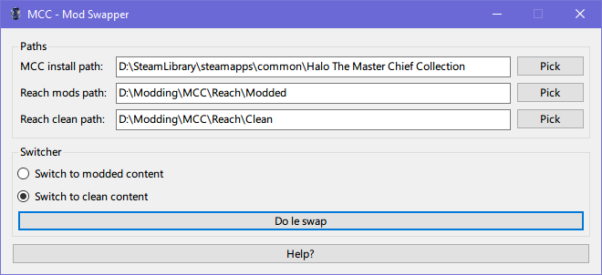

# MCC Mod Swapper

Easily switch between modded and clean content on MCC for the PC.

## Download?

Just head over to the [releases](https://github.com/0xdeafcafe/MccModSwapper/releases) section and grab the latest release.

## Usage

1. Copy all of the files and folders in the `haloreach` folder in your MCC install directory somewhere else. One folder with just clean files, and one where you'll keep your modified content.

1. Once you've done that, open the app and select each directory or paste them into the text boxes.

1. Use the switcher to switch between clean and modded content. It's that simple 💃

## How it works

The app heavily relies on Symlinking (symbolic linking). What this bascially does is creates a shortcut that the operating system will treat as a real folder. Think of it as a portal. The folder `haloreach` exists in your MCC install directory, but the contents of it actually exist elsewhere on your computer.

You can read more about symbolic links [here](https://en.wikipedia.org/wiki/Symbolic_link "Wikipedia article on Symbolic Links").

## Contributing

If you'd like to make any changes, please just open a PR. Just please keep to the coding standards set out by the rest of the project.

## Issues

If you find any issues, please open an issue on the repo and I'll have a look into it. The application creates a log file (`log{date}.txt`), so posting that in your issue will be very helpful!

